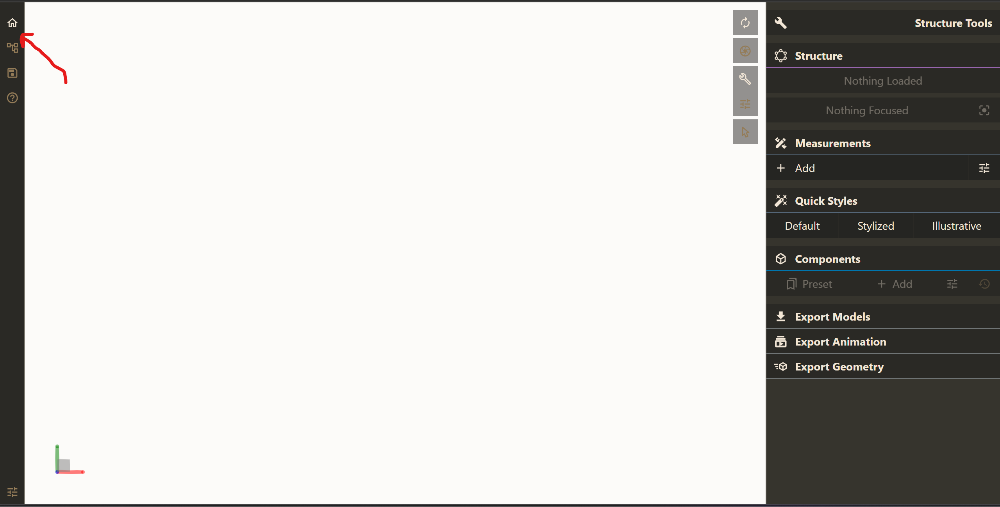
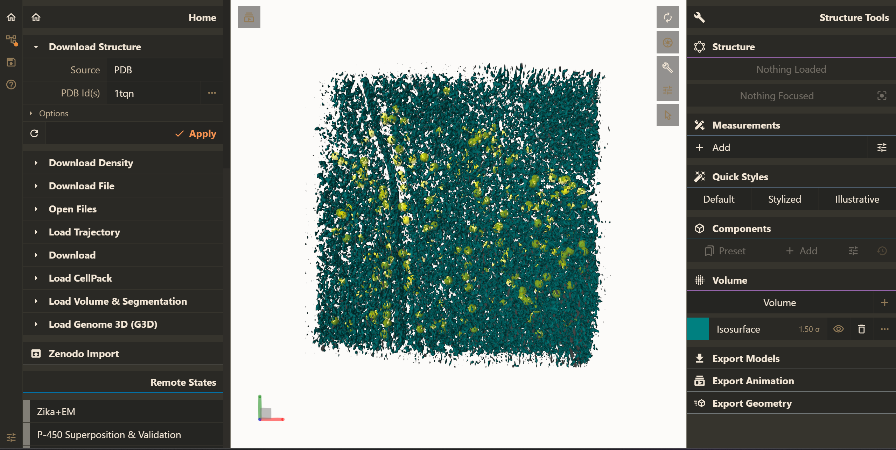

# Tomoprocessor

Tomoprocessor

# Installation

Clone this GitHub repository: 

```
git clone https://github.com/aliaksei-chareshneu/cellstar-volume-server-v2
cd cellstar-volume-server-v2
```

# Setting up the environment

Create conda environment from `environment-local.yaml`, e.g.:

You can use [Conda](https://conda.io/projects/conda/en/latest/user-guide/install/index.html)

```
conda env create -f environment-local.yaml
```


Or [Mamba](https://mamba.readthedocs.io/en/latest/installation.html)

```
mamba env create -f environment-local.yaml
```

> **Note**
> 
> If `environment-local.yaml` would not work, try to use `environment-mac-test.yaml` instead

# Running tomoprocessor
Activate created conda environment, e.g.

```
conda activate tomoprocessor
```

From root project directory (cellstar-volume-server-v2 by default) run e.g.:


<!-- TODO add args -->
```
python tomoprocessor\cellstar_tomoprocessor\tomoprocessor.py
                --map MAP_FILE_PATH.map
                --particles-star-file PARTICLES_STAR_FILE_PATH.star
                --pixel-size 7.84
                --max-volume-size-mb 100
                --default-isovalue-sigma 2
                --working-folder TEMP_WORKING_FOLDER
                --out OUTPUT_ZIP.zip
                --sphere-radius 16
                --sphere-color 16776960
                --entry-id ENTRY-123
                --source-db pdbe
                --star-file-coordinate-divisor 4
```

Arguments description:
 <!-- - `--csv_with_entry_ids` - csv file with entry ids and info for preprocessor, default - test-data\preprocessor\db_building_parameters_all_entries.csv (not recommended to use default for users, as it requires static files to be hosted at specific location, use --csv_with_entry_ids test-data/preprocessor/db_building_parameters_custom_entries.csv instead) -->
 <!-- - `--raw_input_files_dir` dir with raw input files for preprocessor, default - test-data/preprocessor//raw_input_files
 - `--db_path` - path to db folder, default - test-data/db -->
 - `--map` - path to map file
 - `--particles-star-file` - path to star file with particles
 - `--pixel-size` - desired pixel size for map
 - `--max-volume-size-mb` - max size for downsampled volume data (determines the number of downsampling steps)
 - `--default-isovalue-sigma` - (not used currently) isovalue
 - `--working-folder` - path to directory where temporary files will be stored during the preprocessing
 - `--out` - path to output zip archive
 - `--sphere-radius` - radius of spheres
 - `--sphere-color` - color of spheres as integer
 - `--entry-id` - entry id
 - `--source-db` - source db
 - `--star-file-coordinate-divisor` - number by which coordinates in star file will be divided (e.g. for bin4 reconstructions it should be "4")


# Visualization at [frontend](https://aliaksei-chareshneu.github.io/tomo-project/index.html)
 - Open [frontend webpage](https://aliaksei-chareshneu.github.io/tomo-project/index.html)
 - Click "Home tab"
 
 - Click "Open Files" and then "Select files ...", then "Apply"
 
 

# Loading data from URL
You can load data hosted elsewhere using "data-source" parameter, e.g.:

```
https://aliaksei-chareshneu.github.io/tomo-project/index.html?data-source=https://whatever.com/data.zip
```

# Testing (sample datasets visualized at [frontend](https://aliaksei-chareshneu.github.io/tomo-project/index.html))

[Dataset 1 (EMPIAR-11658, 9.rec and spheres based on 80S_bin1_cryoDRGN-ET_clean_tomo_9.star)](https://aliaksei-chareshneu.github.io/tomo-project/index.html?data-source=https://aliaksei-chareshneu.github.io/tomo-project/test_zip.zip)

[Dataset_2 (EMPIAR-11658 171.rec and spheres based on 80S_bin1_cryoDRGN-ET_clean_tomo_171.star)](https://aliaksei-chareshneu.github.io/tomo-project/index.html?data-source=https://aliaksei-chareshneu.github.io/tomo-project/171.zip)

[Dataset_3 (EMPIAR-11756 27042022_BrnoKrios_Arctis_grid9_hGIS_Position_13.mrc and sphere based on rln_ribosome_bin1_tomo_298.star)](https://aliaksei-chareshneu.github.io/tomo-project/index.html?data-source=https://aliaksei-chareshneu.github.io/tomo-project/EMPIAR-11756.zip)
